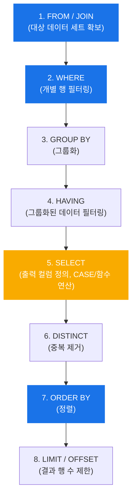
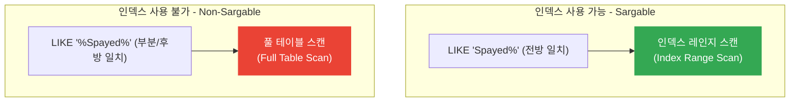

# 📘 SQL DQL Deep Dive Guide: Conditional Logic and Pattern Matching

이 가이드는 [59409.sql](file:///Users/morgan/Documents/workspace/260710_dql/59409.sql)(프로그래머스 "중성화 여부 파악하기") 소스 코드를 바탕으로 작성되었습니다. MySQL을 기준으로 하되 표준 SQL 스펙을 아우르며, 초심자부터 SQLD 자격증 준비생, 그리고 면접을 앞둔 주니어 개발자까지 모두 학습할 수 있도록 구성했습니다.

---

## 1. 🔍 기반 문제 및 코드 분석

기반이 되는 문제는 동물 보호소에 들어온 동물 중 중성화(`Neutered` 또는 `Spayed`)된 동물을 감별하여 'O', 그렇지 않으면 'X'로 표시하는 DQL(Data Query Language) 작성입니다.

### 💻 제출 코드 분석 (CASE vs IF)

```sql
-- 방법 1: 표준 SQL CASE 표현식 (권장)
SELECT
    ANIMAL_ID,
    NAME,
    CASE
        WHEN SEX_UPON_INTAKE LIKE '%Neutered%' OR SEX_UPON_INTAKE LIKE '%Spayed%' THEN 'O'
        ELSE 'X'
    END AS '중성화'
FROM ANIMAL_INS
ORDER BY ANIMAL_ID;

-- 방법 2: MySQL 전용 IF 함수
SELECT
    ANIMAL_ID,
    NAME,
    IF(
        SEX_UPON_INTAKE LIKE '%Neutered%' OR SEX_UPON_INTAKE LIKE '%Spayed%',
        'O',
        'X'
    ) AS '중성화'
FROM ANIMAL_INS
ORDER BY ANIMAL_ID;
```

#### ⚖️ 두 방식의 비교 분석
* **`CASE WHEN` (표준 SQL)**: ANSI SQL 표준으로 모든 DBMS(Oracle, PostgreSQL, SQL Server 등)에서 동작하므로 **코드의 이식성(Portability)**이 높습니다.
* **`IF` 함수 (MySQL 전용)**: 문법이 간결하고 가독성이 좋으나, MySQL/MariaDB 외 타 RDBMS에서는 지원하지 않아 **종속성**이 발생합니다.

---

## 2. 🧩 초심자를 위한 SQL 비유 가이드

데이터베이스가 낯선 초심자를 위해 실생활의 사물과 행동에 비유하여 개념을 설명합니다.

### 📂 테이블(Table), 행(Row), 열(Column)
* **테이블 (Table)**: 회사 캐비닛에 보관된 **'인적사항 대장(바인더 파일)'**입니다.
* **행 (Row/Record)**: 대장 안의 **'개별 종이 문서(한 명의 정보)'**입니다. 가로로 읽습니다.
* **열 (Column/Attribute)**: 문서 안에 인쇄된 **'기입 항목(이름, 생년월일, 주소)'**입니다. 세로로 분류됩니다.

### 🏭 CASE WHEN 표현식의 비유
> [!NOTE]
> **컨베이어 벨트 위의 스마트 분류기**
> 
> 공장 컨베이어 벨트 위로 사과(Row)들이 지나갑니다. `CASE WHEN` 분류기는 각 사과를 검사합니다.
> * **WHEN** "색상이 빨갛고 크기가 10cm 이상인가?" 🍎 **THEN** "A급 상자"로 보냅니다.
> * **WHEN** "흠집이 있고 크기가 5cm 미만인가?" 🍏 **THEN** "주스용 상자"로 보냅니다.
> * **ELSE** "모두 B급 상자"로 분류합니다.
> * **END** 분류 작업을 마칩니다.

### 🔍 LIKE 연산자와 와일드카드(`%`)의 비유
* **`LIKE '%Spayed%'`**: 두꺼운 백과사전에서 단어를 찾을 때, **"앞뒤에 어떤 단어가 붙든 상관없이 중간에 'Spayed'라는 단어가 포함된 모든 페이지를 찾아라"**는 형광펜 검색과 같습니다.
* **`%` (퍼센트)**: 글자 수 제한이 없는 빈칸(`___...`)을 의미합니다.
* **`_` (언더바)**: 딱 글자 1개만을 의미하는 빈칸(`_`)입니다.

---

## 3. ⚙️ 주니어를 위한 작동 원리 및 구조 설명

### 🔄 SQL 엔진의 논리적 실행 순서 (Logical Query Processing Order)

우리가 SQL을 작성하는 순서(Lexical Order)와 데이터베이스 엔진이 내부적으로 쿼리를 처리하는 순서(Logical Order)는 완전히 다릅니다. 이 차이를 아는 것이 SQL 튜닝과 디버깅의 시작입니다.



#### 💡 원리적 해석: Alias(별칭) 사용 한계의 이유
* 쿼리 작성 시: `SELECT ANIMAL_ID AS ID FROM ANIMAL_INS WHERE ID = 3;` (에러 발생)
* **이유**: `WHERE` 절은 `SELECT` 절보다 **먼저** 실행됩니다. 엔진이 `WHERE` 절을 실행하는 시점에는 `ID`라는 별칭(Alias)이 정의되지 않았기 때문에 에러가 발생합니다.
* 반면, `ORDER BY` 절은 `SELECT`보다 **나중**에 실행되므로 `SELECT`에서 정의한 별칭을 자유롭게 사용할 수 있습니다.

### ⚡ LIKE 연산자와 인덱스(Index)의 작동 구조
인덱스는 책의 맨 뒤에 있는 **'찾아보기(색인)'**와 같습니다. 단어가 가나다 순으로 정렬되어 있습니다.



* **`LIKE 'Neutered%'` (전방 일치)**: 검색어가 'N'으로 시작함을 알기 때문에 인덱스 사전에서 'N'단락을 찾아 빠르게 범위를 좁힐 수 있습니다. (**Index Range Scan**)
* **`LIKE '%Neutered%'` (양방향 와일드카드)**: 시작 글자를 알 수 없으므로, 사전의 첫 페이지부터 마지막 페이지까지 모두 훑어야 합니다. (**Full Table Scan**) 데이터가 많을 경우 심각한 성능 저하가 발생합니다.

---

## 4. 📝 추상화 및 일반화된 패턴 예시 코드

실무에서 재사용할 수 있도록 특정 비즈니스 도메인을 탈피하고 일반화된 템플릿 코드를 제공합니다.

### 템플릿 1: 다중 속성 기준 상태 분류 (Searched CASE)
특정 상태나 조건 필드의 텍스트 패턴을 분석하여 마스터 그룹을 생성하는 정형화된 코드입니다.

```sql
SELECT
    entity_id,
    entity_name,
    CASE
        WHEN category_code LIKE 'VIP%' OR total_amount >= 1000000 THEN 'Premium'
        WHEN category_code LIKE 'STD%' AND total_amount >= 500000  THEN 'Active'
        ELSE 'General'
    END AS customer_tier
FROM target_table
WHERE is_active = 1;
```

### 템플릿 2: Null 대치와 조건 판별 결합 (COALESCE + CASE)
실무에서 자주 발생하는 NULL 데이터를 안전하게 처리하며 조건 분류를 적용하는 방식입니다.

```sql
SELECT
    item_id,
    COALESCE(description, 'No Description Available') AS refined_desc,
    CASE
        WHEN status_flag IS NULL OR status_flag = 'D' THEN 'Inactive'
        ELSE 'Active'
    END AS service_status
FROM inventory_items;
```

---

## 5. 🎓 SQLD 자격증 대비 핵심 핵심 이론

SQL 개발자(SQLD) 검정시험에 자주 출제되는 과목2(SQL 기본 및 활용) 핵심 내용을 요약합니다.

### ⚖️ CASE 표현식의 두 가지 문법 구조

| 구분 | 단순 CASE 표현식 (Simple Case Expression) | 검색된 CASE 표현식 (Searched Case Expression) |
| :--- | :--- | :--- |
| **특징** | 특정 칼럼/표현식의 동등(=) 비교만 가능 | 다양한 비교 연산자(`LIKE`, `>`, `<`, `BETWEEN` 등) 및 논리 연산자 사용 가능 |
| **문법** | `CASE expression WHEN value THEN .. ELSE .. END` | `CASE WHEN condition THEN .. ELSE .. END` |
| **예시** | `CASE GENDER WHEN 'M' THEN '남' ELSE '여' END` | `CASE WHEN AGE >= 19 THEN '성인' ELSE '미성년' END` |

### 🕳️ NULL의 정의와 삼가 논리 (Three-Valued Logic)
SQLD에서 단골로 출제되는 오답 함정입니다.

1. **NULL의 정의**: 
   * '0'도 아니고, 빈 문자열('')도 아닙니다. **'알 수 없는 값(Unknown)'** 혹은 **'부재(Missing)'**를 뜻합니다.
   * 따라서 `NULL = NULL`은 참(`TRUE`)이 아니라 **알 수 없음(`UNKNOWN`)**입니다.
2. **비교 연산**: 
   * NULL을 비교할 때는 반드시 `IS NULL` 또는 `IS NOT NULL` 연산자를 사용해야 합니다.
3. **삼가 논리 진리표 (AND / OR)**:

| 연산 A | 연산 B | A AND B | A OR B |
| :--- | :--- | :--- | :--- |
| **TRUE** | **UNKNOWN (NULL)** | **UNKNOWN** | **TRUE** |
| **FALSE** | **UNKNOWN (NULL)** | **FALSE** | **UNKNOWN** |
| **UNKNOWN** | **UNKNOWN** | **UNKNOWN** | **UNKNOWN** |

### 🛠️ RDBMS별 대표 DML/DQL 내장 함수 비교

| RDBMS | NULL 대체 함수 | 조건식 함수 |
| :--- | :--- | :--- |
| **표준 SQL** | `COALESCE(val1, val2, ...)` | `CASE WHEN ... THEN ... END` |
| **Oracle** | `NVL(val1, val2)` | `DECODE(val, search, result, default)` |
| **SQL Server**| `ISNULL(val1, val2)` | `CASE WHEN ... THEN ... END` |
| **MySQL** | `IFNULL(val1, val2)` | `IF(cond, val1, val2)` |

---

## 6. 💬 기술 면접 예상 질문 & 모범 답안

### Q1. SELECT 절에서 정의한 Alias(별칭)를 WHERE 절에서 사용할 수 없는 이유와, SQL Server/MySQL 등 일부 DBMS에서 ORDER BY 절이나 HAVING 절에서는 사용 가능한 이유를 설명해 주세요.
> **모범 답안**
> SQL 쿼리는 작성하는 순서대로 실행되지 않고, 내부의 **논리적 실행 순서(Logical Query Processing Order)**에 따라 동작합니다.
> 1. 엔진은 가장 먼저 `FROM`과 `JOIN`을 처리하여 대상 데이터를 모으고, 그 다음 `WHERE` 절을 통해 조건에 맞는 개별 행을 필터링합니다.
> 2. `SELECT` 절은 `WHERE` 절보다 한참 뒤에 실행되기 때문에, `WHERE` 절이 실행되는 시점에는 `SELECT`에서 정의한 Alias를 인지할 수 없어 에러가 발생합니다.
> 3. 반면 `ORDER BY` 절은 `SELECT` 절보다도 가장 마지막 단계에서 실행되므로, 이미 `SELECT`에서 가공 및 명명된 Alias를 정상적으로 참조하여 정렬할 수 있습니다. (MySQL의 경우 `GROUP BY`와 `HAVING`에서도 예외적으로 SELECT Alias의 참조를 지원하지만 표준 SQL 엔진 기준으로는 SELECT 이후 단계인 ORDER BY에서만 참조 가능한 것이 원칙입니다.)

### Q2. `LIKE '%keyword%'` 쿼리가 성능 저하를 유발하는 기술적인 이유와 이를 최적화하기 위한 방안에 대해 설명해 주세요.
> **모범 답안**
> 데이터베이스 테이블에 인덱스(B-Tree Index)가 생성되어 있더라도, `LIKE '%keyword%'`와 같이 검색어 앞부분에 와일드카드(`%`)가 붙으면 인덱스의 정렬 구조를 활용할 수 없습니다. 
> 인덱스는 데이터가 정렬된 상태로 저장되므로 시작값을 알면 특정 범위를 탐색하는 **인덱스 레인지 스캔(Index Range Scan)**이 가능하지만, 앞을 모르면 정렬 순서와 상관없이 전체 인덱스 페이지 혹은 테이블 데이터를 다 읽어야 하는 **풀 테이블 스캔(Full Table Scan)**을 수행하기 때문에 대용량 데이터에서 성능이 매우 나빠집니다.
> **해결 방안**으로는:
> 1. 비즈니스 요구사항을 검토하여 가능하면 **전방 일치 패턴(`LIKE 'keyword%'`)**으로 쿼리를 수정하여 인덱스를 타게 만듭니다.
> 2. 텍스트 검색 양이 많다면 일반 B-Tree 인덱스가 아닌 **역색인(Inverted Index)** 구조를 사용하는 **전체 텍스트 인덱스(Full-Text Index)**를 적용합니다.
> 3. 전문적인 검색 기능이 필요하다면 Elasticsearch와 같은 **검색 전용 엔진**으로 검색 요청을 이관(Offloading)합니다.

### Q3. 표준 SQL의 `CASE WHEN` 표현식과 MySQL의 `IF` 함수의 장단점과 선택 기준을 설명해 주세요.
> **모범 답안**
> * **`CASE WHEN`**은 표준 SQL 스펙으로 모든 관계형 데이터베이스에서 사용 가능하여 **애플리케이션의 이식성과 DBMS 전환성**을 높여줍니다. 다중 조건 분기가 복잡할 때도 가독성이 유지되는 장점이 있습니다.
> * **`IF` 함수**는 MySQL/MariaDB에서 제공하는 독자적 함수로, 삼항 연산자 구조(`IF(조건, 참, 거짓)`)를 지녀 단순 참/거짓 분기 시 코드가 간결해진다는 장점이 있으나 DBMS 종속적이라는 단점이 있습니다.
> * 따라서, 단순 애드혹(Ad-hoc) 분석 쿼리나 MySQL 환경이 100% 보장되는 서비스라면 `IF`를 사용해 가독성을 높일 수 있으나, 다양한 DBMS로의 확장이나 제품 패키징 개발 환경이라면 포터빌리티를 보장하기 위해 표준 **`CASE WHEN`**을 사용하는 것이 권장됩니다.
