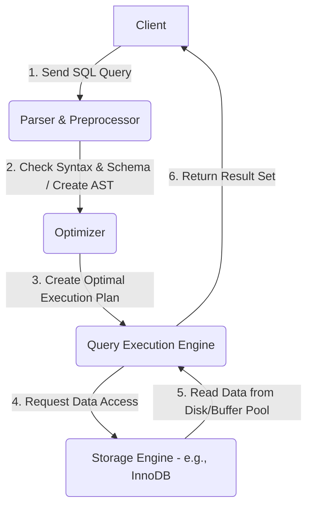
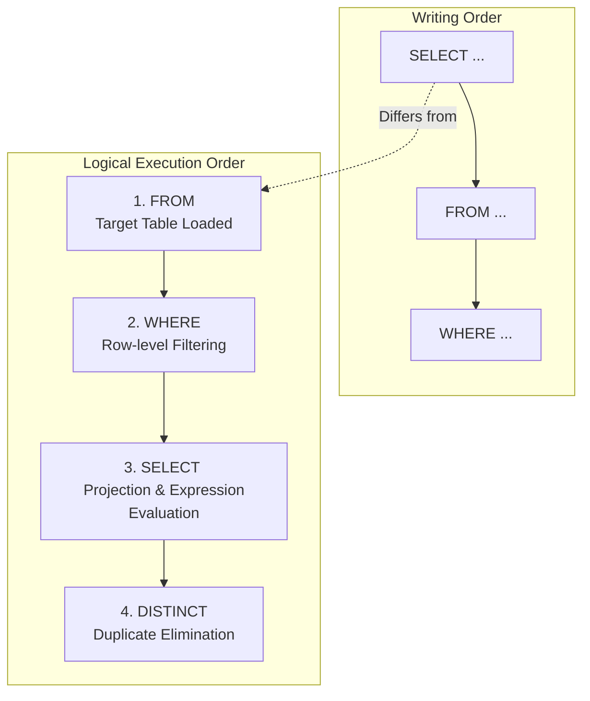
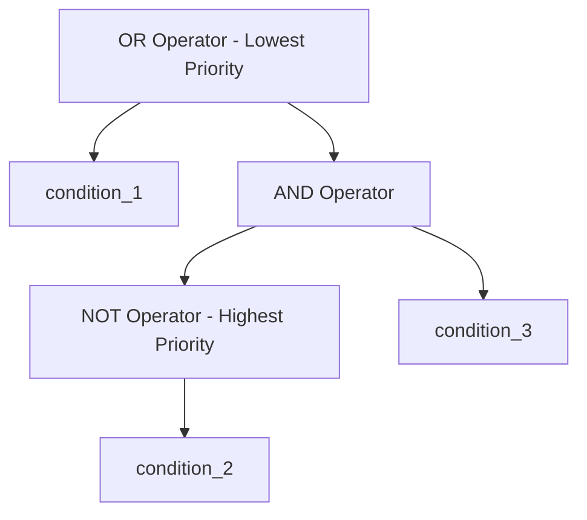

# MySQL DQL (Data Query Language) 기초 및 SQLD 대비 가이드

이 가이드는 [step1.sql](file:///Users/morgan/Documents/workspace/260710_dql/step1.sql)의 코드를 분석하고, **MySQL 기준의 DQL 문법**과 국가공인 **SQLD(SQL 개발자) 자격시험에 빈출되는 핵심 이론**을 집대성한 문서입니다. 초심자의 비유부터 주니어를 위한 작동 원리, 그리고 시험 대비용 3값 논리 및 문자열 비교 법칙까지 다룹니다.

---

## 1. 초심자를 위한 SQL 비유 가이드 💡

데이터베이스와 SQL이라는 낯선 개념을 일상생활의 요소에 빗대어 쉽게 이해해 봅시다.

### 🏢 데이터베이스와 테이블: '대형 서류함'과 '스프레드시트'
* **데이터베이스(Database)**: 회사나 학교에 있는 거대한 **'서류 캐비닛'**입니다. 이 캐비닛 안에는 여러 개의 서류 파일이 들어갈 수 있습니다.
* **테이블(Table)**: 캐비닛 안에 보관된 각각의 **'엑셀 스프레드시트 파일'**입니다. 
  * **열(Column/Attribute)**: 엑셀 시트의 **'세로줄(헤더)'**입니다. 상품명, 가격, 재고량 등 데이터의 속성을 규정합니다.
  * **행(Row/Record/Tuple)**: 엑셀 시트의 **'가로줄(실제 데이터)'**입니다. 특정 상품 하나의 모든 정보가 담긴 한 줄을 의미합니다.

### 🔍 DQL (SELECT): '원하는 정보만 골라주는 비서'
DQL(Data Query Language)은 서류함에서 원하는 조건의 문서와 항목만 콕 집어 보여달라고 비서에게 부탁하는 명령어입니다.

| SQL 핵심 키워드 | 비서에게 내리는 명령어 (비유) | 엑셀 작업으로 치면? |
| :--- | :--- | :--- |
| **`SELECT`** | "서류에서 **이 이름의 열(속성)들만** 보여줘." | 가로축(열) 중 불필요한 열을 숨김 처리하고 보고 싶은 열만 표시하기 |
| **`FROM`** | "**이 서류 파일(테이블)**을 가져와서 열어줘." | 특정 이름의 엑셀 시트 탭을 클릭해 활성화하기 |
| **`WHERE`** | "그중에서 **이 조건에 맞는 줄(행)들만** 필터링해줘." | 필터 기능을 켜서 특정 조건(예: 가격 > 10,000원)을 체크하기 |
| **`DISTINCT`** | "중복되는 값들은 빼고, **종류가 무엇무엇이 있는지 딱 한 번씩만** 보여줘." | 특정 열의 데이터를 복사한 뒤 '중복된 항목 제거' 실행하기 |
| **`AS` (Alias)** | "컬럼 이름이 너무 딱딱하니까 화면에는 **별명(임시 이름)**으로 띄워줘." | 표의 열 머리글 이름을 발표용 보고서에 맞게 임시로 변경하기 |

### ⚖️ 논리 연산자: '필터링 조건 조합하기'
* **`AND` (그리고)**: "가성비가 좋은 기기여야 해." → **노트북**이면서 **가격이 50만 원 이하**인 것 (두 조건이 **모두** 참이어야 선택)
* **`OR` (또는)**: "아무거나 괜찮아." → **노트북**이거나 **마우스**인 것 (둘 중 **하나라도** 참이면 선택)
* **`NOT` (부정)**: "이건 빼고 보여줘." → 카테고리가 **가전제품이 아닌** 것 (조건의 결과를 뒤집음)
* **괄호 `()`**: 사칙연산에서 곱셈을 덧셈보다 먼저 하듯, 괄호로 묶인 조건을 가장 먼저 묶어서 필터링합니다.

---

## 2. 주니어를 위한 작동 원리 및 구조 설명 ⚙️

단순히 쿼리를 작성하는 것을 넘어, MySQL 엔진이 작성된 SQL을 어떻게 해석하고 실행하는지 내부 동작과 아키텍처를 이해해 봅니다.

### 🔄 MySQL 쿼리 실행의 물리적 단계
클라이언트가 SQL을 전송하면 MySQL 서버 내부에서는 아래와 같은 아키텍처 흐름을 거쳐 결과를 반환합니다.



1. **파서 및 전처리 단계(Parser & Preprocessor)**: SQL의 문법 오류(Syntax Error)를 점검하고, 테이블이나 컬럼이 실제 데이터베이스에 존재하는지(Semantic) 권한은 있는지 확인합니다. 이 과정에서 쿼리를 컴퓨터가 읽기 쉬운 트리 구조(AST)로 변환합니다.
2. **옵티마이저(Optimizer)**: 데이터베이스의 핵심 브레인입니다. 인덱스 통계 정보 등을 바탕으로 가장 비용이 적게 드는 **최적의 실행 계획(Execution Plan)**을 수립합니다. (Full Table Scan을 할지, Index Scan을 할지 결정)
3. **실행 엔진(Query Execution Engine)**: 수립된 실행 계획에 따라 스토리지 엔진에 데이터를 요청하고, 전달받은 데이터를 정렬/필터링하여 가공합니다.
4. **스토리지 엔진(Storage Engine)**: 실제 디스크나 메모리(Buffer Pool)에서 필요한 레코드를 읽어옵니다. (MySQL의 기본 엔진은 InnoDB)

---

### ⏱️ DQL 구문의 논리적 실행 순서 (Logical Query Processing)

개발자가 작성하는 쿼리의 순서(Writing Order)와 RDBMS가 내부적으로 필터링을 수행하는 순서(Execution Order)는 **다릅니다**. 이 차이를 이해하는 것이 쿼리 튜닝과 버그 방지의 첫걸음입니다.



1. **`FROM` 단계**: 조회할 대상 테이블을 메모리에 올리고, 조인(JOIN) 등이 있다면 임시 결과 테이블을 구성합니다.
2. **`WHERE` 단계**: 로드된 데이터에서 조건식(Predicate)을 평가하여 조건에 맞지 않는 행을 필터링합니다. **이 단계에서 인덱스(Index)가 적용되어 불필요한 I/O를 크게 줄입니다.**
3. **`SELECT` 단계**: 필터링된 행들을 대상으로 요청한 컬럼만 추출(Projection)하며, 표현식 계산(`1 + 1`, `now()`), 함수 호출 등을 수행합니다. `AS` 별칭(Alias)도 이 단계에서 공식 선언됩니다.
4. **`DISTINCT` 단계**: `SELECT`를 마친 결과 집합에서 중복된 행을 제거하기 위해 내부적으로 정렬(Sort) 또는 해시(Hash) 연산을 수행합니다.

> [!IMPORTANT]
> **왜 `WHERE` 절에서는 `SELECT` 절에서 지정한 별칭(Alias)을 쓸 수 없을까요?**
>
> 논리적 실행 순서상 `WHERE`가 `SELECT`보다 **먼저** 실행되기 때문입니다. 데이터베이스 엔진이 `WHERE` 절을 평가할 때는 아직 `SELECT` 절에 정의된 별칭(`AS '상품ID'`)이 무엇인지 모르는 상태이므로 오류가 발생합니다.

---

### 🧮 논리 연산자 우선순위와 AST (Abstract Syntax Tree)

논리 연산자 `AND`, `OR`, `NOT`은 수학의 연산자처럼 명확한 우선순위를 가집니다.
* **우선순위 순서**: `NOT` ➡️ `AND` ➡️ `OR`

#### 예시 조건식 분석
```sql
WHERE condition_1 OR NOT condition_2 AND condition_3
```

이 식은 괄호가 없을 때 다음과 같이 해석됩니다:
```sql
WHERE condition_1 OR ((NOT condition_2) AND condition_3)
```

이 연산의 우선순위를 파서가 트리 구조(AST)로 표현하면 다음과 같습니다.



---

## 3. 🎓 SQLD 합격을 위한 핵심 요점 정리 (빈출 포인트)

SQLD 시험 통과를 위해 반드시 암기하고 이해해야 하는 중요 과목별 이론 요소들입니다.

### 📌 1. 전체 SELECT 문의 6단계 논리적 실행 순서
시험에 단골로 출제되는 핵심 순서입니다. 반드시 외워두어야 합니다.

```
FROM ➡️ WHERE ➡️ GROUP BY ➡️ HAVING ➡️ SELECT ➡️ ORDER BY
```
* **기억법**: **프(F) - 웨(W) - 그(G) - 해(H) - 셀(S) - 오(O)**
* `ORDER BY`와 `SELECT`의 순서 관계로 인해, `ORDER BY`에서는 `SELECT`에서 정의한 Alias(별칭)를 사용할 수 있습니다. (반면 `WHERE`나 `GROUP BY`에서는 불가능)

---

### 📌 2. NULL의 연산 법칙과 3값 논리 (3-Valued Logic)
SQLD에서 수험생들을 가장 많이 탈락시키는 함정 카드입니다.

#### A. NULL과의 산술 연산
* **NULL은 0이나 공백(' ')이 아닌, '알 수 없는 값(Unknown/Missing Value)'**입니다.
* **법칙**: NULL이 포함된 모든 사칙연산의 결과는 무조건 **NULL**입니다.
  * `NULL + 10 ➡️ NULL`
  * `NULL * 0 ➡️ NULL`
  * `SUM(컬럼)` 연산 시 NULL 값은 자동으로 연산 대상에서 제외됩니다. (단, 모든 행이 NULL이면 결과는 NULL)

#### B. 3값 논리 (Three-Valued Logic) 표
비교 연산 시 NULL이 개입하면 결과는 참(TRUE)도 거짓(FALSE)도 아닌 **UNKNOWN(NULL)**이 됩니다.

| 연산 A | 연산 B | A AND B | A OR B | NOT A |
| :--- | :--- | :--- | :--- | :--- |
| **TRUE** | **UNKNOWN** | **UNKNOWN** | **TRUE** | FALSE |
| **FALSE** | **UNKNOWN** | **FALSE** | **UNKNOWN** | TRUE |
| **UNKNOWN** | **UNKNOWN** | **UNKNOWN** | **UNKNOWN** | **UNKNOWN** |

> [!CAUTION]
> **`WHERE discount = NULL` 은 항상 거짓(UNKNOWN)을 반환하여 아무것도 조회되지 않습니다.**
> 반드시 **`WHERE discount IS NULL`** 또는 **`WHERE discount IS NOT NULL`** 문법을 사용해야 합니다.

---

### 📌 3. 문자열 비교 법칙 (CHAR vs VARCHAR)
두 데이터 타입 간의 비교 연산 시 적용되는 규칙은 시험에 매우 자주 출제됩니다.

* **CHAR (고정 길이)**:
  * 비교 시 서로 길이가 다르면, **짧은 쪽에 스페이스(공백)를 채워서(Padding) 길이를 같게 만든 후** 앞에서부터 비교합니다.
  * 따라서 `'CHAR'`와 `'CHAR  '`는 **같다(Equal)**고 판단합니다.
* **VARCHAR (가변 길이)**:
  * 공백을 채우지 않고 있는 그대로 비교합니다. 맨 뒤에 있는 공백도 하나의 문자 데이터로 취급합니다.
  * 따라서 `'VARCHAR'`와 `'VARCHAR  '`는 **다르다(Not Equal)**고 판단합니다.
* **CHAR와 VARCHAR의 비교**:
  * VARCHAR 비교 규칙을 따릅니다. 즉, 패딩 처리를 하지 않으므로 `'A'`(CHAR)와 `'A '`(VARCHAR)는 **서로 다르다**고 판단합니다.

---

## 4. 일반화 및 추상화된 DQL 예시 코드 📝

실무 및 시험 대비용으로 즉시 학습할 수 있는 일반화 템플릿입니다.

### A. 기본 DQL 및 가상 테이블
```sql
-- 1. 상수/함수 연산 결과 반환 (MySQL은 FROM 생략 가능, Oracle 호환시 DUAL 사용)
SELECT [expression] AS [alias_name] FROM DUAL;

-- 2. 중복 행 제거 조회 (DISTINCT)
SELECT DISTINCT [column_name] FROM [table_name];
```

### B. NULL 및 문자 필터링
```sql
-- 1. NULL 데이터 필터링 (IS NULL 사용 필수)
SELECT [column_list] FROM [table_name] WHERE [column_name] IS NULL;

-- 2. NULL이 아닌 데이터 필터링
SELECT [column_list] FROM [table_name] WHERE [column_name] IS NOT NULL;
```

---

## 5. SQLD 및 기술 면접 예상 질문 & 모범 답안 💬

### Q1. SQLD 단골 빈출인 SELECT 구문의 전체 논리적 실행 순서를 차례대로 나열하고, 이 순서로 인해 발생하는 현상의 예시를 들어보세요.
> **[모범 답안]**
> 논리적 실행 순서는 **`FROM ➡️ WHERE ➡️ GROUP BY ➡️ HAVING ➡️ SELECT ➡️ ORDER BY`** 입니다.
> 이 순서 때문에 발생하는 대표적인 현상은 다음과 같습니다:
> 1. `WHERE` 절은 `SELECT` 절보다 먼저 실행되므로 `SELECT` 절에서 지정한 별칭(Alias)을 사용할 수 없습니다.
> 2. `ORDER BY` 절은 `SELECT` 절보다 나중에 실행되므로 `SELECT` 절에서 선언한 컬럼 별칭을 자유롭게 사용할 수 있습니다.

---

### Q2. SQL에서 NULL과의 산술 연산 결과는 어떻게 되며, Aggregate Function(집계 함수) 처리 시 NULL은 어떻게 반영되나요?
> **[모범 답안]**
> 1. **산술 연산**: NULL과의 모든 사칙연산(+, -, *, /) 결과는 무조건 **NULL**입니다. (예: `100 + NULL = NULL`)
> 2. **집계 함수**: `SUM`, `AVG`, `MIN`, `MAX` 등의 그룹 집계 함수는 **NULL 값을 연산 대상에서 무시(제외)**하고 계산합니다. (단, `COUNT(*)`는 NULL이 포함된 행의 개수도 세어줍니다. 반면 `COUNT(컬럼)`은 NULL 데이터를 제외한 건수만 반환합니다.)

---

### Q3. CHAR 타입 컬럼에 저장된 값 'SQLD'와 VARCHAR 타입 컬럼에 저장된 값 'SQLD  '(뒤에 공백 2개 포함)를 '=' 비교 연산자로 비교하면 결과는 참입니까 거짓입니까? 원리와 함께 설명해 주세요.
> **[모범 답안]**
> 결과는 **거짓(False)**입니다.
> **서로 다른 데이터 타입(CHAR와 VARCHAR)**을 비교할 때는 **VARCHAR의 비교 방식**을 따르게 됩니다. VARCHAR 비교 방식은 문자열 뒤의 공백도 유효한 문자로 취급하므로 공백 패딩을 수행하지 않습니다. 따라서 공백이 없는 `'SQLD'`와 공백 2개가 붙어 있는 `'SQLD  '`는 서로 다른 문자로 취급되어 비교 결과는 거짓이 됩니다.

---

### Q4. SQL 3값 논리(3-Valued Logic)에서 'UNKNOWN AND FALSE'와 'UNKNOWN OR TRUE'의 결과는 각각 무엇입니까?
> **[모범 답안]**
> * **`UNKNOWN AND FALSE` ➡️ `FALSE`**입니다. AND 연산은 양쪽 조건 중 하나만 확실히 FALSE여도 최종 결과가 FALSE가 되기 때문입니다.
> * **`UNKNOWN OR TRUE` ➡️ `TRUE`**입니다. OR 연산은 양쪽 조건 중 하나만 확실히 TRUE여도 최종 결과가 TRUE가 되기 때문입니다.

---

### Q5. SELECT DISTINCT와 GROUP BY의 기능적 차이와 SQLD 관점에서의 용도에 대해 설명해 주세요.
> **[모범 답안]**
> * **`DISTINCT`**는 `SELECT` 결과 리스트에서 단순히 동일한 값을 가진 중복 레코드들을 하나로 합쳐서 출력하는 데 사용되며, 집계 함수와 함께 그룹별 계산을 할 수 없습니다.
> * **`GROUP BY`**는 테이블의 레코드를 특정 컬럼 값을 기준으로 그룹화하여 `SUM`, `AVG`, `COUNT` 등과 같은 **그룹 집계 함수를 적용하여 새로운 연산 결과를 도출할 때** 필수적으로 사용됩니다. 단순히 정적인 값 요약만 원한다면 `DISTINCT`를 사용하지만, 그룹 기준의 수치화가 목적이라면 `GROUP BY`를 사용해야 합니다.
