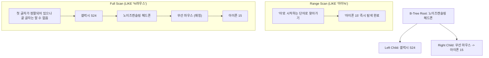

# MySQL DQL 연산자, 정렬 및 행 제한 가이드 (SQLD 핵심 포인트 포함)

이 가이드는 [step2.sql](file:///Users/morgan/Documents/workspace/260710_dql/step2.sql)의 코드를 바탕으로 MySQL의 비교/범위/패턴 매칭 연산자, 결과 정렬(`ORDER BY`), 출력 행 제한(`LIMIT`) 문법을 깊이 있게 다룹니다. 초심자용 비유, 주니어용 B-Tree 인덱스 매커니즘, 그리고 SQLD 합격을 위한 필수 개념을 포함하고 있습니다.

---

## 1. 초심자를 위한 SQL 비유 가이드 💡

데이터베이스 필터링과 정렬, 행 제한을 일상생활의 상황에 비유하여 알아봅시다.

### 🔍 연산자: '온라인 쇼핑몰 검색 및 필터'
* **`BETWEEN A AND B` (A 이상 B 이하 가격 필터)**: 
  * 쇼핑몰에서 가격대를 **'89,000원 이상 150,000원 이하'**로 설정하여 검색하는 것과 같습니다. 양 끝에 입력한 최소값과 최대값 상품도 필터 결과에 포함됩니다.
* **`IN (목록)` (장바구니 골라담기)**:
  * 카테고리 필터에서 **'전자제품'**과 **'액세서리'**에 동시에 체크표시를 하는 것입니다. 카테고리가 둘 중 하나에만 해당하면 화면에 나타납니다.
* **`LIKE` (검색창 자동완성 및 키워드 검색)**:
  * 특정 단어가 포함된 상품을 찾을 때 사용합니다.
  * **`%` (글자 수 제한 없음 프리패스)**: `'아이폰%'`는 '아이폰'으로 시작하는 모든 단어('아이폰 15', '아이폰 SE' 등)와 매칭됩니다.
  * **`_` (글자당 칸막이)**: `'__폰'`은 앞에 딱 두 글자만 오고 '폰'으로 끝나는 단어('아이폰', '갤럭시폰')와 매칭됩니다. ('노이즈캔슬링폰'처럼 글자 수가 안 맞으면 탈락)

### 📊 ORDER BY와 LIMIT: '줄 세우기'와 '페이지네이션'
* **`ORDER BY` (대열 줄 세우기)**:
  * 학생들을 키가 작은 순서(`ASC`, 오름차순) 또는 큰 순서(`DESC`, 내림차순)로 정렬하는 것입니다. 키가 같은 학생이 있을 경우, 2차 기준인 몸무게순(`ORDER BY 키 ASC, 몸무게 DESC`)으로 정렬합니다.
* **`LIMIT N, M` (게시판 페이지 넘기기)**:
  * 도서관에서 책을 번호순으로 정렬한 뒤, **"앞의 N권을 건너뛰고(Offset), 그다음 M권만 보여줘"**라고 요청하는 것입니다. 
  * 게시판에서 2페이지(11번~20번 글)를 보여주기 위해 앞의 10개 글을 건너뛰는 원리와 같습니다.

---

## 2. 주니어를 위한 작동 원리 및 구조 설명 ⚙️

데이터베이스 내부 구조와 검색 성능의 관계를 이해하여 더 나은 쿼리를 작성하는 역량을 길러봅시다.

### 🌳 LIKE 연산자와 B-Tree 인덱스 스캔의 매커니즘

인덱스(Index)는 사전처럼 단어가 정렬되어 있는 구조(일반적으로 B-Tree 구조)를 가집니다. `LIKE` 검색의 와일드카드(`%`) 위치에 따라 인덱스를 타고 빠르게 검색할 수 있는지, 아니면 전체 테이블을 다 읽어야 하는지가 결정됩니다.



* **Index Range Scan이 가능한 경우 (`LIKE '아이%'`)**:
  * 검색 키워드의 앞부분이 고정되어 있으므로, 인덱스 트리에서 `'아'`로 시작하는 위치를 이진 탐색으로 찾아가 해당 범위만 읽습니다. 성능이 매우 뛰어납니다.
* **Full Table Scan이 발생하는 경우 (`LIKE '%마우스'`)**:
  * 첫 글자가 무엇인지 알 수 없으므로, 데이터가 정렬되어 있어도 인덱스를 무용지물로 만들고 **모든 데이터를 처음부터 끝까지 스캔**해야 합니다.

---

### ⏳ ORDER BY의 정렬 방식과 Sort Buffer
`ORDER BY`는 데이터를 특정 순서로 출력하기 위해 두 가지 방식 중 하나를 사용합니다.

1. **인덱스 스캔 정렬 (Index-based Sort)**:
   * 정렬하려는 컬럼에 이미 인덱스가 걸려 있다면 데이터가 사전에 정렬되어 있으므로, 인덱스 순서대로 읽기만 하면 정렬 작업이 즉시 끝납니다. **최선의 정렬 성능**을 보장합니다.
2. **파일 정렬 (Filesort)**:
   * 인덱스가 없거나 사용할 수 없는 경우, MySQL은 대상 레코드를 읽어 메모리 공간인 **소트 버퍼(Sort Buffer)**에 올린 뒤 정렬 연산(Quick Sort 등)을 직접 수행합니다. 
   * 정렬할 데이터가 소트 버퍼 크기보다 크면 디스크에 임시 파일을 만들어 정렬하므로 디스크 I/O가 크게 발생하여 **성능이 급격히 저하**됩니다.

---

### ⚠️ LIMIT offset, limit의 대량 데이터 성능 저하 문제
MySQL의 `LIMIT N, M`은 직관적이지만 대용량 테이블에서 치명적인 문제를 유발합니다.
* **동작 원리**: 만약 `LIMIT 1000000, 10`을 요청하면 데이터베이스 엔진은 내부적으로 **1,000,010개의 레코드를 전부 읽은 뒤**, 앞의 1,000,000개를 버리고 마지막 10개만 사용자에게 반환합니다.
* **문제점**: 페이지가 뒤로 갈수록 불필요한 레코드 조회가 많아져 쿼리 응답 속도가 무한정 늘어납니다.
* **해결법 (No-Offset 페이징)**:
  ```sql
  -- 이전 페이지의 마지막 PK 값(예: 1000000)을 조건절에 직접 전달하여 이전 데이터를 아예 건너뛰고 스캔하도록 유도
  WHERE product_id < 1000000
  ORDER BY product_id DESC
  LIMIT 10;
  ```

---

## 3. 🎓 SQLD 합격을 위한 핵심 요점 정리 (빈출 포인트)

SQLD 시험에 자주 등장하는 함정과 핵심 연산자 특성을 완벽히 정리합니다.

### 📌 1. NOT IN 과 NULL의 치명적인 공집합 함정
SQLD 객관식 시험에서 오답률이 가장 높은 빈출 유형입니다.

```sql
WHERE category NOT IN ('Electronics', NULL)
```
* **결과**: 이 조건은 항상 **아무런 데이터도 조회하지 않습니다 (공집합 반환)**.
* **이유**: `NOT IN`은 내부적으로 `AND` 연산자로 풀어집니다.
  ```sql
  -- 변환 전
  category NOT IN ('Electronics', NULL)
  -- 변환 후
  category != 'Electronics' AND category != NULL
  ```
  * SQL에서 `category != NULL`의 평가는 참(TRUE)이 아닌 **UNKNOWN**이 됩니다.
  * `AND` 조건식에 하나라도 `UNKNOWN`이 섞이면 전체 조건문의 결과는 절대 `TRUE`가 될 수 없습니다. (3값 논리 법칙)
  * 따라서 조건절이 통과되지 않아 결과는 **0건**이 됩니다. (단, `IN (..., NULL)`은 `OR` 연산자로 변환되므로 다른 컬럼이 일치하면 조회 가능합니다.)

---

### 📌 2. LIKE 연산자에서의 특수 문자 검색 (ESCAPE 절)
데이터에 포함된 실제 백분율 기호(`%`)나 언더바(`_`)를 패턴 매칭이 아닌 일반 문자로 검색하고 싶을 때 사용합니다.

```sql
-- '_' 기호 자체를 검색하기 위해 '#' 기호를 탈출 문자(Escape)로 선언
WHERE product_name LIKE '%#_%' ESCAPE '#';
```
* 이 쿼리는 상품명에 언더바(`_`)가 포함된 상품을 찾습니다. `ESCAPE` 뒤에는 사용자 지정 특수기호(예: `#`, `\`)가 올 수 있습니다.

---

### 📌 3. 데이터베이스 제품별 ORDER BY에서의 NULL 정렬 순서
NULL은 데이터베이스에서 최소 혹은 최대값으로 취급되며, 그 기준은 DB 엔진에 따라 상이합니다.

| 데이터베이스 | NULL의 기본 처리 위치 (ASC / 오름차순 기준) | NULL의 크기 비교 기준 |
| :--- | :--- | :--- |
| **Oracle** | **가장 마지막**에 배치됨 | NULL을 **가장 큰 값**으로 취급 |
| **SQL Server / MySQL** | **가장 처음**에 배치됨 | NULL을 **가장 작은 값**으로 취급 |

* SQLD 시험에서는 보통 Oracle 기준으로 출제되므로 **"오름차순(ASC) 시 NULL은 끝에 오고, 내림차순(DESC) 시 NULL은 처음에 온다"**를 정답으로 골라야 합니다.

---

### 📌 4. DB 제품군별 출력 행 제한(Row Limiting) 문법 비교
각 벤더사마다 쿼리 결과를 제한하는 방식이 달라 시험에 빈출됩니다.

* **MySQL**: `LIMIT [offset], [count]`
* **Oracle 11g**: `WHERE ROWNUM <= [count]` (주의: ROWNUM은 1부터 시작해야 하므로 `ROWNUM = 5`나 `ROWNUM > 5`는 조건에 맞지 않아 데이터가 안 나옵니다.)
* **SQL Server**: `SELECT TOP [count] [column_name] ...`
* **ANSI SQL / Oracle 12c+**: `OFFSET [offset] ROWS FETCH FIRST [count] ROWS ONLY;`

---

## 4. 일반화 및 추상화된 DQL 예시 코드 📝

### A. 범위 및 리스트 필터링
```sql
-- 1. BETWEEN AND 연산자를 활용한 범위 조건 필터링 (양 끝값 포함)
SELECT [column_list] FROM [table_name] WHERE [column_name] BETWEEN [min_val] AND [max_val];

-- 2. IN 연산자를 활용한 특정 값들의 다중 동등 매칭
SELECT [column_list] FROM [table_name] WHERE [column_name] IN ([value_1], [value_2], ...);
```

### B. 와일드카드 패턴 매칭
```sql
-- 1. 지정 키워드로 시작하는 행 검색 (Index Range Scan 가능)
SELECT [column_list] FROM [table_name] WHERE [column_name] LIKE '[keyword]%';

-- 2. 지정 키워드로 끝나는 행 검색 (Full Table Scan 유발)
SELECT [column_list] FROM [table_name] WHERE [column_name] LIKE '%[keyword]';

-- 3. 특정 특수문자(_, %)를 포함하는 문자열 정밀 검색
SELECT [column_list] FROM [table_name] WHERE [column_name] LIKE '%#[special_char]%' ESCAPE '#';
```

### C. 정렬 및 다중 컬럼 정렬
```sql
-- 1. 1차 기준 컬럼 오름차순(ASC), 2차 기준 컬럼 내림차순(DESC) 다중 정렬
SELECT [column_list] FROM [table_name] ORDER BY [column_A] ASC, [column_B] DESC;

-- 2. SELECT 절의 순서 인덱스 번호를 사용한 결과 정렬 (비권장되나 문법 가능)
-- 아래 예시는 column_name_2 기준으로 내림차순 정렬함
SELECT [column_name_1], [column_name_2] FROM [table_name] ORDER BY 2 DESC;
```

---

## 5. 기술 면접 및 SQLD 예상 질문 & 모범 답안 💬

### Q1. LIKE 연산자 사용 시 와일드카드(%)의 위치에 따라 쿼리 성능(Index)이 어떻게 바뀌는지 B-Tree 인덱스 관점에서 설명해 주세요.
> **[모범 답안]**
> B-Tree 인덱스는 데이터를 좌측 첫 글자부터 사전식 순서로 정렬하여 저장합니다. 
> 따라서 `LIKE '아이폰%'`와 같이 와일드카드가 **뒤**에 오는 경우 첫 글자가 명확하여 인덱스 정렬 정보를 활용한 **Index Range Scan**이 가능합니다. 
> 반면, `LIKE '%마우스'`와 같이 와일드카드가 **앞**에 오는 경우는 탐색의 기준이 되는 앞 글자가 정해지지 않아 정렬 상태인 인덱스 내부를 이진 탐색할 수 없고, 결국 테이블 전체를 읽어 비교하는 **Full Table Scan**이 발생하여 성능이 저하됩니다.

---

### Q2. `WHERE member_id NOT IN (1, 2, NULL)` 쿼리가 실행되었을 때 반환되는 행의 개수는 몇 개이며, 왜 그런 결과가 나오는지 설명하세요.
> **[모범 답안]**
> 반환되는 행의 개수는 **0개 (공집합)**입니다.
> `NOT IN` 연산자는 내부적으로 `AND` 연산자들의 조합으로 변환됩니다. 따라서 이 조건은 `member_id != 1 AND member_id != 2 AND member_id != NULL`과 동치가 됩니다. 
> SQL에서 NULL과의 비교 연산(`member_id != NULL`)은 결과가 항상 **UNKNOWN(알 수 없음)**이 되며, `AND` 결합 조건식에서 피연산자 중 하나가 `UNKNOWN`인 경우 전체 논리 식의 최종 결과도 `UNKNOWN`이 됩니다. 조건절의 최종 결과가 TRUE인 데이터만 반환되기 때문에 결과는 아무것도 반환되지 않는 0건이 됩니다.

---

### Q3. RDBMS 제품군인 Oracle과 MySQL에서 ORDER BY 시 NULL 값이 정렬되는 기본 위치의 차이와 그 이유를 설명해 주세요.
> **[모범 답안]**
> 두 DBMS는 NULL 값의 크기 비교 기본 정의가 다릅니다.
> **Oracle**은 NULL을 **가장 큰 값**으로 간주합니다. 따라서 오름차순(ASC) 시 NULL이 맨 마지막에 위치하고, 내림차순(DESC) 시 맨 처음에 위치합니다.
> 반면 **MySQL**은 NULL을 **가장 작은 값**으로 간주합니다. 따라서 오름차순(ASC) 시 NULL이 맨 처음에 위치하고, 내림차순(DESC) 시 맨 마지막에 출력됩니다.

---

### Q4. ORDER BY 절에서 컬럼명 대신 `ORDER BY 2 DESC`와 같이 숫자를 사용하는 정렬 방식의 문제점은 무엇인가요?
> **[모범 답안]**
> SELECT 절에 명시된 컬럼 목록의 순서 번호(Index)를 지정해 정렬하는 방식은 가독성을 떨어뜨리고 유지보수를 어렵게 만듭니다. 
> 추후 비즈니스 요구사항 변경으로 인해 `SELECT` 절의 컬럼 순서가 바뀌거나 새로운 컬럼이 중간에 삽입되는 경우, `ORDER BY`의 정렬 기준 대상 컬럼이 의도치 않게 바뀌어 잘못된 결과를 제공하는 버그가 발생합니다. 따라서 실무에서는 정렬 기준 컬럼명을 명시하는 것이 권장됩니다.

---

### Q5. 대규모 서비스 환경에서 페이징을 위해 `LIMIT 500000, 10`과 같이 큰 Offset 값을 설정했을 때 발생하는 문제점과 이를 해결할 수 있는 대안을 제시해 주세요.
> **[모범 답안]**
> `LIMIT 500000, 10`은 데이터베이스 엔진이 내부적으로 500,010개의 레코드를 디스크나 버퍼 풀에서 전부 읽어온 뒤(Fetch), 앞의 500,000개를 그냥 버리고 10개만 반환하는 방식으로 동작합니다. 이는 막대한 불필요 I/O와 CPU 낭비를 일으켜 심각한 성능 저하를 초래합니다.
> 이를 극복하기 위해 이전 페이지의 마지막 식별자(PK) 값을 조건문에 넣어 스캔 범위를 직접 제한하는 **No-Offset(커서 기반) 페이징** 기법(`WHERE id < last_seen_id ORDER BY id DESC LIMIT 10`)을 사용하여 성능을 최적화할 수 있습니다.
