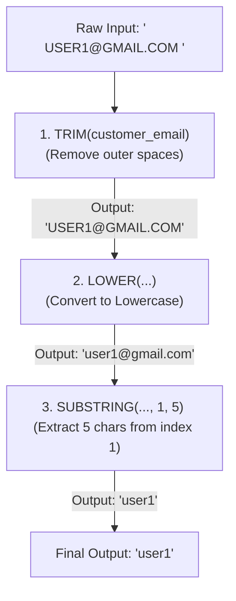

# MySQL DQL NULL 처리 및 문자열 가공 가이드 (SQLD 핵심 포인트 포함)

이 가이드는 [step3.sql](file:///Users/morgan/Documents/workspace/260710_dql/step3.sql)의 코드를 바탕으로 MySQL의 NULL 검증(`IS NULL`), 대표적인 NULL 대체 함수(`IFNULL`, `COALESCE`), 그리고 필수 문자열 가공 함수(`TRIM`, `LOWER`, `CONCAT` 등)를 심도 있게 다룹니다. 초심자용 비유, 주니어용 작동 원리, 그리고 SQLD 합격을 위한 필수 개념을 포함하고 있습니다.

---

## 1. 초심자를 위한 SQL 비유 가이드 💡

데이터베이스에서의 NULL 값 처리와 문자열을 다듬는 기법을 일상생활의 상황에 비유해 봅시다.

### 📦 NULL 검증: '빈 상자 판별법'
* **`NULL`은 0이나 공백 문자(' ')가 아닌 '텅 비어 있는 미지의 상자'**입니다.
* **`discount = NULL` (잘못된 질문)**:
  * 비서에게 "상자 안에 든 게 10이랑 같니?"라고 물었는데, 상자가 닫혀 있고 안이 비어 있으니 비서는 "알 수 없습니다(UNKNOWN)"라고 답할 수밖에 없습니다.
* **`discount IS NULL` (올바른 질문)**:
  * 비서에게 "이 상자가 비어 있니?"라고 겉모습을 검증해 달라고 요청하는 것입니다. 비서는 비어 있다면 "예(TRUE)", 차 있다면 "아니오(FALSE)"라고 명확히 대답합니다.
* **`IFNULL` / `COALESCE` (기본값 설정 룰)**:
  * 회원 가입 시 이메일 상자가 비어 있다면(`NULL`) 화면에 '이메일 없음'이라는 기본 글씨를 대신 출력해 주도록 자동 규칙을 세우는 것입니다.

### ✂️ 문자열 가공: '문서 서식 정리'
* **`TRIM` (앞뒤 여백 가위질)**:
  * 종이 문서 양쪽 끝에 지저분하게 삐져나온 빈 공간(공백)을 가위로 싹둑 잘라내는 것입니다.
* **`LOWER` / `UPPER` (영문자 규격 통일)**:
  * 뒤죽박죽 입력된 영문 알파벳을 전부 소문자(`LOWER`)나 대문자(`UPPER`)로 일괄 서식을 통일하여 보기 좋게 정돈하는 것입니다.
* **`SUBSTRING` (필요한 부분만 오려내기)**:
  * 주민등록번호나 전화번호에서 뒷자리 혹은 특정 위치의 글자 몇 개만 오려내는 서식 작업입니다.
* **`CONCAT` (문자열 풀칠하기)**:
  * "상품명" 카드와 "고객 이메일" 카드 사이에 한 칸 공백 카드를 넣고 풀칠하여 하나의 긴 카드로 이어 붙이는 작업입니다.

---

## 2. 주니어를 위한 작동 원리 및 구조 설명 ⚙️

데이터베이스가 NULL을 관리하는 내부 논리와 중첩된 함수들을 물리적으로 연산하는 과정을 파헤쳐 봅니다.

### 🔍 SQL의 3값 논리(3-Valued Logic)와 NULL의 물리적 실체
RDBMS에서 NULL은 데이터 값을 저장할 때 메모리에 기록되는 '물리적인 마커(Marker)'입니다. 
* **물리적 구조**: DBMS 내부 레코드 헤더에는 각 컬럼의 NULL 여부를 표시하는 **Null Bitmap**이 존재합니다. 실제 데이터 영역이 아니라 이 비트맵을 통해 값이 비어 있는지를 판별합니다.
* **비교 불가성**: 데이터베이스 엔진은 값의 실체가 없는 NULL을 비교 연산자(`=`, `!=`, `<`, `>`)로 처리할 경우 컴퓨터 연산 장치가 참/거짓을 평가할 수 없기 때문에 결과값을 **`UNKNOWN`**으로 분류합니다. `WHERE` 절은 오직 최종 평가가 `TRUE`인 레코드만 내보내므로, `WHERE discount = NULL` 쿼리는 무조건 통과하는 행이 0건이 됩니다.

---

### 🔄 중첩 함수(Nested Functions)의 스택 실행 구조
SQL은 여러 개의 가공 함수를 겹쳐서 작성할 수 있으며, 데이터베이스 엔진은 이를 **안쪽 함수부터 바깥쪽 함수 방향(Bottom-Up)**으로 평가하여 메모리 스택에 적재합니다.

#### 실행 예시 조건식
```sql
SUBSTRING(LOWER(TRIM(customer_email)), 1, 5)
```

이 식의 물리적 데이터 흐름과 단계별 파싱 과정은 다음과 같습니다.



* **동작 원리**: 안쪽의 `TRIM` 연산이 완료된 임시 데이터 버퍼가 부모 함수인 `LOWER`에 인자로 주입되며, 최종적으로 가장 바깥의 `SUBSTRING` 함수가 작동하여 최종 추출 문자열을 완성합니다.

---

### ⚠️ 문자열 연산자 '+'의 함정 (MySQL vs 타 DBMS)
* **MySQL**: 더하기 연산자(`+`)를 오직 **산술 연산(Addition)** 용도로만 해석합니다. 만약 `'abc' + 1`을 수행하면 문자열 `'abc'`를 숫자로 변환할 수 없으므로 `0`으로 묵시적 캐스팅(Implicit Cast)한 뒤 `1`을 더해 `1`을 반환합니다.
* **타 RDBMS (SQL Server, Oracle)**: 문자열의 덧셈 연산자(`+` 또는 `||`)를 결합 용도로 지원합니다. 따라서 DBMS 이식성을 고려할 때 문자열 결합은 전용 내장 함수인 **`CONCAT()`**을 쓰는 것이 안전합니다.

---

## 3. 🎓 SQLD 합격을 위한 핵심 요점 정리 (빈출 포인트)

SQLD 시험 과목에서 변별력을 높이기 위해 빈출되는 NULL 관련 표준 함수와 결합 법칙입니다.

### 📌 1. 데이터베이스 제품별 NULL 처리 함수 비교
SQLD 시험 문제에 반드시 등장하는 함수 비교 표입니다. 암기가 필수적입니다.

| 함수명 | 표준 여부 | DBMS 지원 | 설명 | 사용 예시 |
| :--- | :--- | :--- | :--- | :--- |
| **`COALESCE`** | **표준 (ANSI)** | 모든 DBMS | 나열된 인자 중 **첫 번째로 NULL이 아닌 값** 반환 | `COALESCE(NULL, NULL, 5, 2) ➡️ 5` |
| **`NULLIF`** | **표준 (ANSI)** | 모든 DBMS | 두 인자가 **같으면 NULL**, **다르면 첫 번째 값** 반환 | `NULLIF(10, 10) ➡️ NULL` <br/> `NULLIF(10, 20) ➡️ 10` |
| **`NVL`** | 비표준 | Oracle | 첫 인자가 NULL이면 두 번째 인자 반환 | `NVL(NULL, 0) ➡️ 0` |
| **`NVL2`** | 비표준 | Oracle | 첫 인자가 NULL이 아니면 2번째, NULL이면 3번째 인자 반환 | `NVL2(5, 10, 20) ➡️ 10` <br/> `NVL2(NULL, 10, 20) ➡️ 20` |
| **`ISNULL`** | 비표준 | SQL Server | 첫 인자가 NULL이면 두 번째 인자 반환 | `ISNULL(NULL, 0) ➡️ 0` |
| **`IFNULL`** | 비표준 | MySQL | 첫 인자가 NULL이면 두 번째 인자 반환 | `IFNULL(NULL, 0) ➡️ 0` |

---

### 📌 2. 문자열 결합 시 NULL의 결합 법칙 차이
문자열 연결 연산자와 함수에 NULL이 인자로 들어왔을 때, RDBMS 종류에 따라 결과가 다르게 나타납니다.

* **Oracle (`||`)**: 
  * NULL을 **길이가 0인 빈 문자열(`''`)**로 취급합니다.
  * 예: `'A' || NULL || 'B' ➡️ 'AB'`
* **MySQL (`CONCAT`)**:
  * 인자 중 **단 하나라도 NULL이 포함되면 최종 결과는 무조건 `NULL`**이 됩니다.
  * 예: `CONCAT('A', NULL, 'B') ➡️ NULL`
  * 대안: MySQL에서 NULL을 무시하고 결합하려면 `CONCAT_WS('-', 'A', NULL, 'B')`를 사용(NULL 인자를 스킵함)하거나 각 인자에 `IFNULL` 처리를 해야 합니다.
* **SQL Server (`+`)**:
  * 설정(`SET CONCAT_NULL_YIELDS_NULL ON`)에 따라 다르나 기본적으로 하나라도 NULL이면 결과는 **`NULL`**이 됩니다.

---

### 📌 3. 문자열 인덱스 기준 (1-Based Indexing)
* 일반 개발 언어(Java, Python)의 문자열 인덱스는 0부터 시작하지만, **SQL 표준의 문자열 인덱스는 `1`부터 시작**합니다.
* `SUBSTR('DATABASE', 1, 4)` ➡️ `'DATA'`
* 만약 인덱스 시작점 인자에 `0`을 기입하더라도, 대부분의 RDBMS는 이를 자동으로 `1`로 치환하여 처리합니다.

---

## 4. 일반화 및 추상화된 DQL 예시 코드 📝

### A. NULL 처리 및 대체
```sql
-- 1. IS NULL / IS NOT NULL 조건절
SELECT [column_list] FROM [table_name] WHERE [column_name] IS NULL;
SELECT [column_list] FROM [table_name] WHERE [column_name] IS NOT NULL;

-- 2. 표준 COALESCE를 사용한 첫 번째 유효값 추출
SELECT COALESCE([col_1], [col_2], [default_value]) AS [resolved_value] FROM [table_name];

-- 3. 표준 NULLIF를 활용한 분모의 0 방지 또는 값 제외 처리
-- 두 컬럼의 값이 일치하면 NULL을 반환함
SELECT NULLIF([column_A], [column_B]) FROM [table_name];
```

### B. 문자열 변환 및 가공
```sql
-- 1. 공백 제거 후 일괄 소문자화 (중첩 사용)
SELECT LOWER(TRIM([string_column])) AS [cleaned_column] FROM [table_name];

-- 2. 부분 문자열 절삭 (1번 인덱스부터 N글자 추출)
SELECT SUBSTRING([string_column], 1, [length]) FROM [table_name];
```

### C. 문자열 안전 결합
```sql
-- 1. MySQL 방식의 다중 문자열 결합 (인자 중 NULL이 없을 때 안전)
SELECT CONCAT([col_1], ' ', [col_2]) FROM [table_name];

-- 2. MySQL의 구분자 동반 결합 (NULL값은 건너뛰고 결합함)
SELECT CONCAT_WS('-', [col_1], [col_2], [col_3]) FROM [table_name];
```

---

## 5. 기술 면접 및 SQLD 예상 질문 & 모범 답안 💬

### Q1. SQLD 및 표준 문법에서 `COALESCE` 함수와 `NULLIF` 함수의 핵심 기능 차이를 설명해 주세요.
> **[모범 답안]**
> * **`COALESCE`**는 여러 인자 중 **첫 번째로 NULL이 아닌 값**을 찾아내는 함수로, 여러 컬럼의 기본값 대체 흐름(Fallback)을 작성할 때 적합합니다.
> * **`NULLIF`**는 두 인자 값을 비교하여 **서로 같으면 NULL**을 반환하고, **서로 다르면 첫 번째 인자 값**을 그대로 반환하는 함수입니다. 주로 0 나누기 오류를 방지하기 위해 분모가 0일 때 NULL로 변환(`NULLIF(divisor, 0)`)하는 목적으로 널리 쓰입니다.

---

### Q2. MySQL에서 `SELECT 'Product' + 10;`을 실행하면 에러가 발생하는지 여부와 실제 출력 결과를 원리와 함께 설명하세요.
> **[모범 답안]**
> 에러가 발생하지 않고 **숫자 `10`이 출력**됩니다.
> MySQL은 더하기(`+`) 연산자를 결합용이 아닌 산술 연산용으로만 처리합니다. 연산 기호 주변에 문자열이 오면 숫자로의 **암시적 형 변환(Implicit Casting)**을 시도합니다. `'Product'`라는 문자열은 숫자로 변환될 수 없기 때문에 묵시적으로 수치형 값인 **`0`**으로 변환되며, 여기에 `10`이 더해져 최종적으로 `10`이 출력됩니다.

---

### Q3. DBMS 제품군에 따라 문자열 결합 연산 시 NULL이 미치는 영향의 차이를 Oracle과 MySQL을 대조하여 설명해 주세요.
> **[모범 답안]**
> * **Oracle**의 문자열 결합 연산자(`||`)는 NULL을 빈 문자열(`''`)처럼 취급하므로 `'A' || NULL || 'B'`의 결과는 `'AB'`가 됩니다.
> * **MySQL**의 `CONCAT` 함수는 인자 목록 중 단 하나라도 NULL이 존재하면 최종 결합 결과가 **`NULL`**이 됩니다. 따라서 MySQL에서 NULL을 무시하고 결합을 수행하려면 `CONCAT_WS` 함수를 사용하거나 개별 인자에 `IFNULL` 처리를 선언해 주어야 합니다.

---

### Q4. Java나 Python 등의 일반 프로그래밍 언어의 슬라이싱과 SQL의 문자열 추출 함수인 `SUBSTRING`의 인덱스 기준 차이점은 무엇인가요?
> **[모범 답안]**
> 대부분의 프로그래밍 언어는 0-Based Index를 사용하여 문자열의 첫 번째 문자가 인덱스 `0`에서 시작합니다. 
> 반면 **SQL 표준은 1-Based Index를 따르므로 첫 번째 문자가 인덱스 `1`에서 시작**합니다. 따라서 첫 문자부터 3글자를 자를 때 일반 언어는 `[0:3]`의 형태를 취하지만, SQL에서는 `SUBSTRING(string, 1, 3)`과 같이 첫 번째 인자로 `1`을 주어야 합니다.

---

### Q5. 데이터베이스에서 `WHERE salary = NULL`을 수행할 때 레코드가 전혀 출력되지 않는 원인을 Null Bitmap 및 3값 논리(3-Valued Logic) 관점에서 서술하세요.
> **[모범 답안]**
> 데이터베이스 레코드 구조에서 NULL은 레코드 헤더의 **Null Bitmap**에 표시되는 논리적 마커로, 실질적인 비교 연산의 대상이 아닙니다. 
> SQL에서 NULL과의 동등 비교(`= NULL`) 연산의 평가는 참(TRUE)도 거짓(FALSE)도 아닌 **UNKNOWN(알 수 없음)**이 됩니다. RDBMS의 `WHERE` 조건절은 오직 논리식 평가 결과가 **TRUE인 행만 필터링하여 출력**하도록 아키텍처가 설계되어 있기 때문에, 최종 결과가 UNKNOWN인 이 쿼리는 결과 집합에 단 하나의 행도 담을 수 없게 됩니다.
