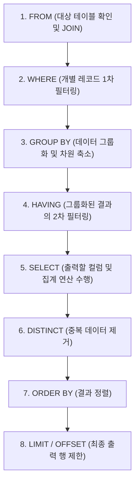

# MySQL DQL 조건식, 집계 및 그룹화 가이드 (SQLD 핵심 포인트 포함)

이 가이드는 [step4.sql](file:///Users/morgan/Documents/workspace/260710_dql/step4.sql)의 조건문(`CASE`, `IF`) 및 집계 함수(`COUNT`, `SUM`, `AVG`, `MAX`, `MIN`)의 예제 코드를 분석하고, **MySQL 기준의 DQL 문법**과 **SQLD 자격시험의 핵심 이론**을 주니어 및 초심자의 시선에 맞춰 상세히 정리한 문서입니다.

---

## 1. 초심자를 위한 SQL 비유 가이드 💡

어려운 SQL 문법과 개념을 일상생활 속 친숙한 상황에 빗대어 쉽게 이해해 봅시다.

### 🎭 조건문 (CASE / IF): '백화점 고객 분류 및 자동 정렬기'
* **Searched CASE (범위 비교 조건식)**: 
  * 백화점의 **'구매 금액별 VIP 등급 판별 룰'**입니다. 직원이 고객카드를 확인하면서 "구매액이 100만 원 이상인가요? 그럼 VIP", "10만 원 이상인가요? 그럼 GOLD", "그 외에는 일반 고객"과 같이 순차적으로 조건을 대조하며 분류하는 작업입니다.
* **Simple CASE (1:1 매칭 조건식)**:
  * 장난감 분류기에서 **'색상별 분류 박스'**와 같습니다. 날아오는 장난감의 속성(카테고리)을 보고 `'가전'`이면 `'철수 상자'`, `'액세서리'`면 `'영희 상자'`, 그 외에는 전부 `'민수 상자'`로 정확히 1:1 대조하여 분류하는 기계식 필터입니다.
* **MySQL `IF` 함수**:
  * 출입문에 달린 **'온도 센서 자동문'**입니다. "열이 37.5도 이상인가? (조건)" 물어보고, 참이면 "경보음(True)", 거짓이면 "통과(False)"를 즉시 결정하는 단순한 양자택일형 장치입니다.

### 📊 집계 함수 (Aggregate Functions): '학급 건강 검진 통계'
* **`COUNT(*)` (총 인원 세기)**:
  * 교실에 앉아 있는 **모든 학생의 머릿수**를 세는 것입니다. 학생이 전화를 안 가지고 있든(NULL), 이름표를 잃어버렸든 상관없이 교실에 자리를 차지하고 있는 모든 인원(행)을 누락 없이 카운트합니다.
* **`COUNT(column)` (특정 장비 보유자 세기)**:
  * 교실에서 **"스마트폰 가지고 있는 사람 손 들어봐"** 하고 손을 든 학생만 세는 것입니다. 스마트폰을 집에 두고 왔거나 없는 학생(NULL)은 집계 대상에서 자연스럽게 제외됩니다.
* **`COUNT(DISTINCT column)` (중복 제거 종류 세기)**:
  * 학생들이 입고 온 **티셔츠의 브랜드 종류가 총 몇 개**인지 세는 것입니다. 여러 명이 나이키를 입었어도 '나이키'라는 브랜드는 딱 한 번만 카운트하여 브랜드의 순수 가짓수를 구해냅니다.
* **`SUM` / `AVG` / `MAX` / `MIN` (학급 수치 계산)**:
  * 학생들의 몸무게 합계(`SUM`), 평균 몸무게(`AVG`), 가장 큰 키(`MAX`), 가장 작은 키(`MIN`)를 구하는 행위입니다. 만약 몸무게 측정을 안 한 학생(NULL)이 있다면, 그 학생은 없는 사람 치고 남은 학생들의 데이터로만 평균과 합계를 냅니다.

### 👥 GROUP BY & HAVING: '동아리별 회식비 정산'
* **`GROUP BY` (팀 나누기)**:
  * 운동장에 모인 학생들을 축구부, 농구부, 밴드부 등 **각자가 가입한 동아리(그룹)별로 따로 모이게** 하는 것입니다.
* **`HAVING` (팀 단위 조건 필터)**:
  * 동아리별로 묶어놓은 상태에서, 교장 선생님이 **"동아리 평균 인원이 10명 이상인 팀에게만 회식비를 지원하겠다"**라고 조건을 거는 것입니다. 개별 학생에 대한 필터(`WHERE`)가 아니라, 이미 묶여버린 **동아리(그룹) 단위의 조건식**입니다.

---

## 2. 주니어를 위한 작동 원리 및 구조 설명 ⚙️

데이터베이스의 내부 아키텍처와 연산 메커니즘을 파헤쳐 주니어 개발자로서의 깊이를 다져봅시다.

### 🔄 SQL 쿼리의 논리적 실행 순서 (Logical Execution Order)
SQL은 코드 작성 순서(Syntactic Order)와 RDBMS 엔진이 실제로 데이터를 처리하는 실행 순서(Logical Order)가 다릅니다. 이 물리적 파싱 원리를 이해하는 것은 성능 최적화와 올바른 쿼리 작성의 첫걸음입니다.



#### 💡 실행 순서로 인해 발생하는 결정적 규칙:
1. **SELECT 별칭(Alias) 사용 불가**: `WHERE`, `GROUP BY`, `HAVING` 단계는 `SELECT` 단계보다 먼저 수행됩니다. 따라서 `SELECT` 절에서 지정한 별명(`AS name`)은 `WHERE` 절이나 `GROUP BY` 절에서 원칙적으로 참조할 수 없습니다. (※ MySQL은 엔진 단에서 `GROUP BY`와 `HAVING`에 한해 Alias를 참조할 수 있도록 편의를 제공하지만, SQL 표준 및 타 RDBMS에서는 문법 에러가 발생합니다.)
2. **WHERE와 HAVING의 분리**: `WHERE`는 그룹화가 일어나기 전의 **개별 행(Row)** 단위 필터링을 수행하며, `GROUP BY` 이후에 생성되는 집계 함수 결과값(예: `SUM(price)`)은 `WHERE` 절에서 평가할 수 없습니다. 집계 데이터는 반드시 `HAVING` 절에서 다루어야 합니다.

---

### ⚠️ 집계 함수와 NULL의 물리적 연산 메커니즘
RDBMS가 집계 함수를 처리할 때 NULL 값을 다루는 방식은 SQLD 시험 및 실무 에러 분석에서 단골로 등장합니다.

1. **NULL 무시의 법칙**: `COUNT(*)`를 제외한 모든 집계 함수(`SUM`, `AVG`, `MAX`, `MIN`, `COUNT(col)`)는 데이터 처리 전 연산 버퍼에서 **NULL인 행을 물리적으로 제외(Skip)**합니다.
2. **분석 비교: `SUM(A + B)` vs `SUM(A) + SUM(B)`**:
   * 만약 아래와 같이 3개의 행을 가진 테이블이 있다고 가정해 봅시다.
     
     | 행 번호 | 컬럼 A | 컬럼 B | A + B |
     | :--- | :--- | :--- | :--- |
     | 1 | 10 | 20 | 30 |
     | 2 | 20 | NULL | **NULL** (SQL에서 NULL과의 모든 연산은 NULL) |
     | 3 | 30 | 40 | 70 |

   * **`SUM(A + B)`**: 각 행의 더하기 연산을 먼저 수행한 후 집계를 실행합니다.
     * `(10+20) + (20+NULL) + (30+40)` ➡️ `30 + NULL + 70` ➡️ NULL은 집계에서 제외되므로 `30 + 70 = 100`이 됩니다.
   * **`SUM(A) + SUM(B)`**: 각 컬럼의 총합을 먼저 구한 뒤 최종적으로 합산합니다.
     * `SUM(A) = 10 + 20 + 30 = 60`
     * `SUM(B) = 20 + 40 (NULL 제외) = 60`
     * 결과 ➡️ `60 + 60 = 120`
   * **결론**: 두 연산의 결과는 전혀 다르므로, 비즈니스 요건에 맞춰 NULL 처리를 어떻게 선행할지 엄밀히 검토해야 합니다.

3. **공집합(Empty Set)에 대한 집계 결과**:
   * 조회 조건에 맞는 행이 0건이거나 대상 컬럼이 전부 NULL인 경우:
     * `COUNT` 함수는 **`0`**을 반환합니다.
     * `SUM`, `AVG`, `MAX`, `MIN` 함수는 **`NULL`**을 반환합니다.

---

### ⚡ CASE 문의 단락 평가 (Short-Circuit Evaluation)
CASE 문은 나열된 `WHEN` 조건절을 **위에서부터 아래로 순차적으로 평가**합니다.
* **단락 평가**: 조건 중 하나가 참(`TRUE`)으로 평가되면, 데이터베이스 엔진은 해당 라인의 결과를 반환하고 **남은 `WHEN` 절은 쳐다보지도 않은 채 연산을 즉시 종료**합니다.
* **영향**: 조건의 배치 순서가 논리적 포함 관계를 가질 때 매우 주의해야 합니다.
  ```sql
  -- 잘못된 배치 예시
  CASE WHEN price >= 100000 THEN '미드레인지'
       WHEN price >= 1000000 THEN '프리미엄' -- 이 조건은 평생 실행되지 않음!
       ELSE '보급형' END
  ```
  * `price`가 `1,500,000`인 데이터는 첫 번째 조건인 `price >= 100000`에서 참이 되므로 바로 `'미드레인지'`를 반환하고 탈락합니다. 따라서 범위가 좁거나 큰 기준이 되는 조건을 **항상 먼저 선언**해야 합니다.

---

## 3. 🎓 SQLD 합격을 위한 핵심 요점 정리 (빈출 포인트)

SQLD 시험 과목에서 고득점을 획득하기 위한 필수 비교 테이블과 암기 요소입니다.

### 📌 1. 집계 함수 결과와 NULL 연산 속성
| 대상 함수 | 입력 행이 전부 NULL인 경우 결과 | 공집합(0건) 입력 시 결과 | NULL이 포함된 행 연산 방식 |
| :--- | :--- | :--- | :--- |
| **`COUNT(*)`** | `0` | `0` | NULL 값을 포함하여 모든 행을 카운트함 |
| **`COUNT(컬럼)`** | `0` | `0` | NULL이 저장된 행을 사전에 필터링하여 제외함 |
| **`SUM(컬럼)`** | **`NULL`** | **`NULL`** | NULL 값을 무시하고 나머지 수치만 합산함 |
| **`AVG(컬럼)`** | **`NULL`** | **`NULL`** | `SUM(컬럼) / COUNT(컬럼)` (즉, NULL 행은 분모/분자 모두에서 제외) |
| **`MAX/MIN(컬럼)`**| **`NULL`** | **`NULL`** | NULL을 제외한 값들 중 최댓값/최솟값을 추출함 |

### 📌 2. Simple CASE vs Searched CASE 문법 비교
| 구분 | Simple CASE (단순 비교형) | Searched CASE (검색형) |
| :--- | :--- | :--- |
| **특징** | 특정 컬럼의 **동등 조건(`=`)** 매칭만 가능 | 비교 연산자, `LIKE`, `IN`, `IS NULL` 등 **다양한 조건식 가능** |
| **문법 구조** | `CASE expression WHEN value THEN ... END` | `CASE WHEN condition THEN ... END` |
| **NULL 판단** | `WHEN NULL` 식을 쓸 수 없음 (`= NULL`로 작동하여 에러/오작동) | `WHEN col IS NULL` 식을 자유롭게 활용 가능 |
| **범용성** | 비교 대상이 하나이고 값의 일치만 볼 때 유용 | 가장 보편적으로 사용되는 표준 문법 |

### 📌 3. WHERE 절 vs HAVING 절 차이점
| 비교 항목 | WHERE 절 | HAVING 절 |
| :--- | :--- | :--- |
| **적용 시점** | 그룹화(`GROUP BY`)를 수행하기 전 | 그룹화(`GROUP BY`)가 완료된 후 |
| **필터 대상** | 개별 물리 행(Row) | 그룹화된 집계 결과 데이터(Group) |
| **집계 함수 사용**| **사용 불가** (`WHERE COUNT(*) > 5` ❌) | **사용 가능** (`HAVING COUNT(*) > 5` ⭕) |
| **인덱스 활용** | 조건 컬럼이 인덱스에 있다면 적극 활용 가능 | 집계된 임시 데이터를 대상하므로 인덱스 직접 활용 불가 |

---

## 4. 일반화 및 추상화된 DQL 예시 코드 📝

실무 및 학습에서 어떤 테이블에나 복사하여 변형해 쓸 수 있도록 일반화된 설계 템플릿 코드입니다.

### A. 조건문 활용 템플릿
```sql
-- 1. Searched CASE 문 (다양한 범위 비교)
SELECT 
    [key_column],
    [numeric_column],
    CASE 
        WHEN [numeric_column] >= [upper_bound] THEN '[high_label]'
        WHEN [numeric_column] >= [lower_bound] THEN '[mid_label]'
        ELSE '[default_label]'
    END AS [calculated_grade],
    
    -- ELSE를 생략하여 조건 불일치 시 NULL이 나오는 경우 처리
    CASE 
        WHEN [status_column] = '[target_status]' THEN '[action_required]'
    END AS [alert_flag]
FROM 
    [table_name];

-- 2. Simple CASE 문 (1:1 매핑)
SELECT 
    [key_column],
    CASE [category_column]
        WHEN '[cat_A]' THEN '[manager_A]'
        WHEN '[cat_B]' THEN '[manager_B]'
        ELSE '[manager_default]'
    END AS [assigned_person]
FROM 
    [table_name];

-- 3. MySQL 전용 IF 함수 및 다중 중첩 IF
SELECT 
    [key_column],
    -- 단일 조건 판단
    IF([string_column] LIKE '%[keyword]%', '[true_val]', '[false_val]') AS [simple_check],
    
    -- 다중 중첩 IF (가독성을 위해 CASE 문을 쓰는 것이 표준상 권장됨)
    IF([numeric_column] > 80, 'A', 
       IF([numeric_column] > 60, 'B', 'C')) AS [nested_check]
FROM 
    [table_name];
```

### B. 집계 및 그룹화 템플릿
```sql
-- 1. 전체 테이블 대상 기본 집계 연산
SELECT 
    COUNT(*) AS [total_row_count],                   -- 누락 없는 전체 행 개수
    COUNT([nullable_column]) AS [valid_data_count],    -- NULL을 제외한 행 개수
    COUNT(DISTINCT [target_column]) AS [unique_types], -- 중복과 NULL을 제외한 고유값 종류 수
    SUM([numeric_column]) AS [sum_value],              -- 총합
    AVG([numeric_column]) AS [average_value],          -- 평균
    MAX([numeric_column]) AS [max_value],              -- 최댓값
    MIN([numeric_column]) AS [min_value]               -- 최솟값
FROM 
    [table_name];

-- 2. GROUP BY 및 HAVING 절을 동반한 다차원 그룹 집계
SELECT 
    [group_column_1],
    [group_column_2],
    COUNT(*) AS [group_row_count],
    SUM([target_metric]) AS [group_sum],
    AVG([target_metric]) AS [group_avg]
FROM 
    [table_name]
WHERE 
    [filter_column] = '[filter_condition]' -- 1단계: 개별 로우 필터링
GROUP BY 
    [group_column_1], 
    [group_column_2]                      -- 2단계: 기준 컬럼으로 데이터 그룹화
HAVING 
    AVG([target_metric]) >= [threshold]    -- 3단계: 평균 결과가 기준치 이상인 그룹만 추출
ORDER BY 
    [group_sum] DESC;                      -- 4단계: 그룹 합계 기준 내림차순 정렬
```

---

## 5. 기술 면접 및 SQLD 예상 질문 & 모범 답안 💬

실제 기업 기술 면접과 국가공인 SQLD 시험에서 단골로 출제되는 서술형 및 객관식 핵심 질문과 고득점 답변 전략입니다.

### Q1. `WHERE` 절과 `HAVING` 절의 결정적인 기능 차이를 SQL 실행 순서 관점에서 설명해 주세요.
> **[모범 답안]**
> * **`WHERE` 절**은 `FROM` 절 바로 다음에 실행되며, 데이터베이스 엔진이 디스크나 메모리 버퍼에서 레코드를 읽어와 **그룹화(`GROUP BY`)하기 전에 개별 행(Row) 단위로 필터 조건**을 평가합니다. 따라서 개별 데이터의 인덱스를 타고 검색 효율을 높일 수 있으나, 그룹 전체를 합산한 집계 함수 결과값은 검증할 수 없습니다.
> * **`HAVING` 절**은 `GROUP BY` 절 뒤에 위치하여, 데이터가 그룹으로 완전히 묶이고 **집계 연산이 수행된 후의 결과물(Group)에 대하여 2차 필터링**을 적용합니다. 이 시점에는 이미 데이터가 축소된 상태이므로 개별 행의 고유 조건보다는 그룹의 통계치를 기준으로 필터링하는 데 적합합니다.

---

### Q2. `COUNT(*)`와 `COUNT(컬럼명)`의 차이점은 무엇이며, 컬럼에 NULL 값이 포함되어 있을 때 각각 어떻게 동작하나요?
> **[모범 답안]**
> * **`COUNT(*)`**는 테이블의 행(Row) 자체의 개수를 세는 함수입니다. RDBMS 엔진은 특정 컬럼의 데이터를 보지 않고 단지 행의 존재성만 확인하므로, **행 내부의 모든 데이터가 NULL이라 하더라도 누락 없이 전체 건수를 카운트**합니다.
> * **`COUNT(컬럼명)`**은 지정한 특정 컬럼에 유효한 값(Value)이 들어 있는 횟수만 세는 함수입니다. 해당 열에 **`NULL` 값이 저장된 행은 집계 연산 버퍼에서 즉시 제외**하고 카운트하므로, `COUNT(*)`의 결과보다 작거나 같은 값을 갖게 됩니다.

---

### Q3. `SUM(col_A) + SUM(col_B)`와 `SUM(col_A + col_B)`의 연산 결과가 서로 달라질 수 있는 구체적인 원리와 상황을 설명하세요.
> **[모범 답안]**
> * 그 차이는 **NULL 값의 전파(Propagation) 법칙**과 **집계 시점의 차이**로 발생합니다.
> * SQL 표준에서 `값 + NULL`과 같이 NULL을 포함한 사칙연산의 결과는 언제나 `NULL`입니다.
> * **`SUM(col_A + col_B)`**는 행별로 덧셈 연산을 먼저 수행합니다. 만약 한 행의 `col_B`가 NULL이라면 그 행의 덧셈 결과는 `NULL`이 되고, `SUM` 함수는 NULL을 무시하므로 해당 행의 값은 최종 합산에서 완전히 증발합니다.
> * 반면, **`SUM(col_A) + SUM(col_B)`**는 각 컬럼에 대해 개별적으로 합계를 구합니다. `col_A` 합계(NULL 제외)와 `col_B` 합계(NULL 제외)를 각각 안전하게 구한 후 두 숫자 결과를 최종적으로 더하기 때문에, 개별 행에 부분적으로 존재했던 NULL 값으로 인한 데이터 유실이 발생하지 않아 두 결과값이 다르게 도출됩니다.

---

### Q4. `CASE` 문에서 `ELSE` 절을 누락했을 때의 기본 동작 방식과 `CASE` 문이 처리되는 내부 연산 원리(단락 평가)에 대해 설명하세요.
> **[모범 답안]**
> * **`ELSE` 절 누락 시 동작**: CASE 문 내부의 모든 `WHEN` 조건 중 어느 것도 참(`TRUE`)으로 만족하지 못하고 `ELSE`마저 명시적으로 작성되지 않았다면, RDBMS 엔진은 디폴트로 **`NULL`을 반환**합니다. (이로 인해 의도치 않은 NULL 에러가 발생할 수 있어 실무에서는 `ELSE` 작성이 강력히 권장됩니다.)
> * **단락 평가(Short-Circuit Evaluation) 원리**: `CASE` 문은 위에서 아래 방향으로 순차적으로 조건식을 검사합니다. 임의의 `WHEN` 조건이 참이 되는 순간, 해당 값을 결과 버퍼에 할당하고 **남은 조건절은 컴파일 및 연산을 수행하지 않고 평가 프로세스를 즉시 종료(Short-Circuit)**합니다. 이 때문에 조건 범위를 지정할 때는 넓은 범위보다 좁고 구체적인 조건을 상단에 명시해야 예외 처리 오류를 피할 수 있습니다.

---

### Q5. `GROUP BY`를 지정한 쿼리의 `SELECT` 절에서 그룹화 기준으로 참여하지 않은 개별 일반 컬럼(예: 그룹화 기준이 아닌 로우 컬럼)을 조회하려 할 때 에러가 발생하는 근본적인 아키텍처적 이유를 서술해 주세요.
> **[모범 답안]**
> * `GROUP BY`가 실행되면 데이터의 **차원(Dimension)과 관계형 구조가 물리적으로 축소**됩니다. 예를 들어, 100개의 개별 로우 데이터가 부서번호 3개를 기준으로 묶이게 되면 최종 결과 집합은 단 3개의 행으로 차원이 붕괴합니다.
> * 이때 부서번호로 그룹화된 행에 부서 내 개별 직원 이름과 같이 다중 값을 가진 일반 컬럼을 단독으로 조회하려 하면, 1개의 그룹 행에 여러 개의 이름 행을 대응시킬 수 없는 **일대다(1:N) 차원 불일치 모순**이 발생합니다.
> * 따라서 RDBMS 엔진은 관계형 무결성을 유지하기 위해 `GROUP BY`가 선언되었을 때 `SELECT` 절에는 **그룹 기준 컬럼** 또는 여러 데이터를 단일 값으로 변환해 주는 **집계 함수(`COUNT`, `SUM` 등)**의 결과만을 출력하도록 강제합니다. (이를 위반할 시 대표적인 'Not a GROUP BY expression' 표준 문법 오류가 야기됩니다.)
